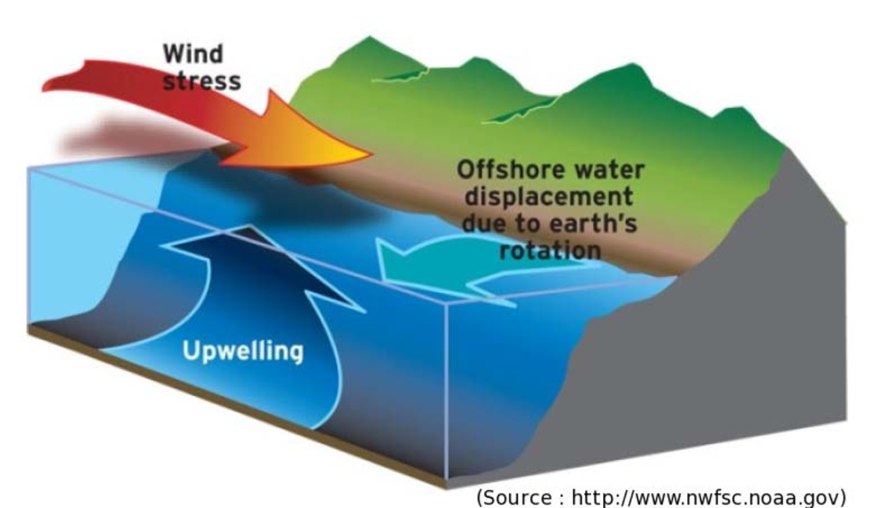
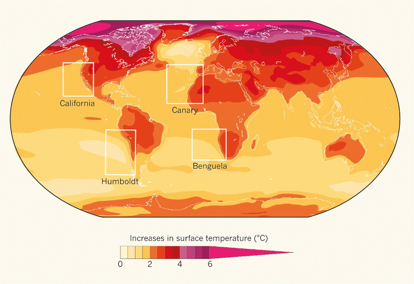
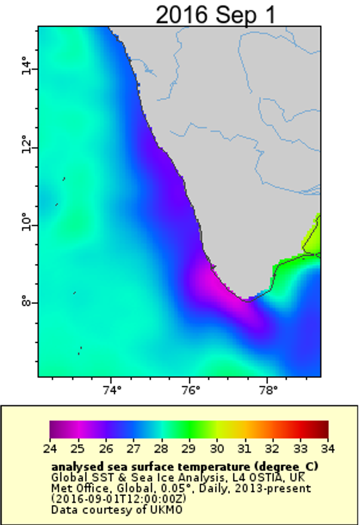
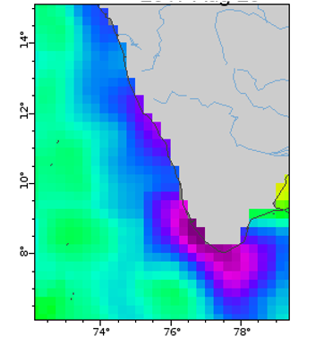
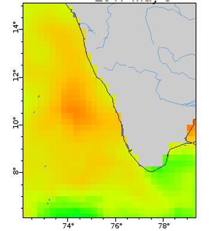
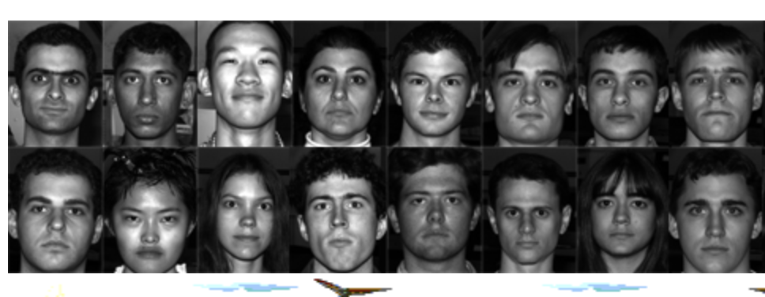
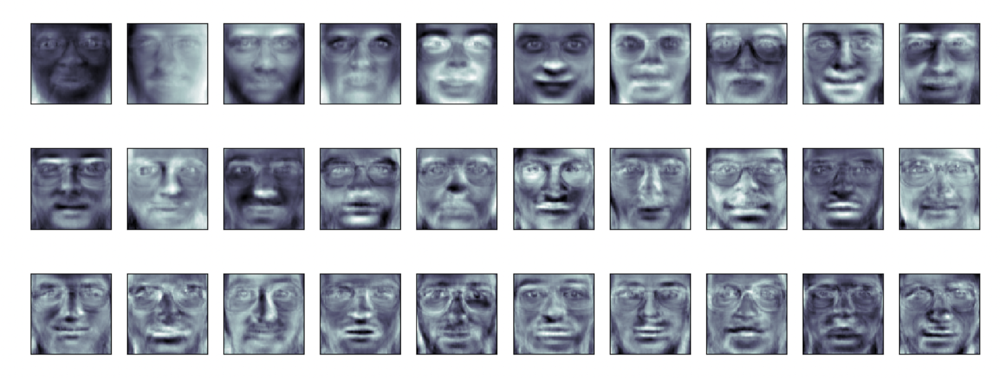
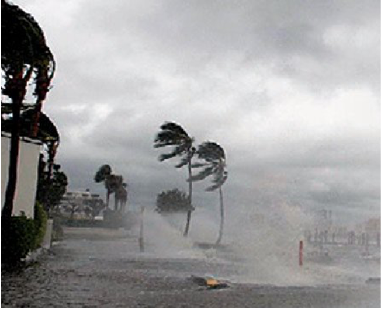
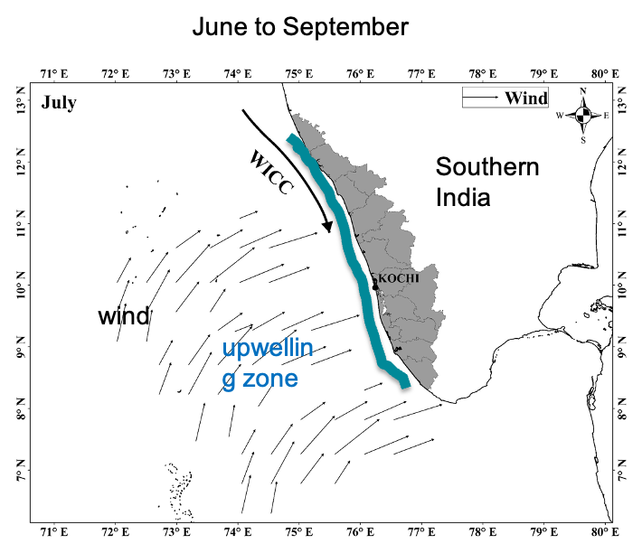

```{r setup, include=FALSE}
knitr::opts_chunk$set(echo = FALSE, cache=FALSE)
library(knitr)
library(ggplot2)
library(factoextra)
library(dplyr)
source(file.path(here::here(), "R", "imgVectortoRaster.R"))
```

## Topics

* Motivation for this study
* Upwelling patterns
* Common types of unsupervised image classification
  * PCA
  * K-means
  * Hierarchical clustering
* Seasonal patterns of upwelling revealed by image classification
* Changes in upwelling in the SEAS

## {data-background="images/incois-cmlre-map.png"}

<div style="background-color: white">
<font size="4"> 
<b>2014-2019</b> NOAA Fisheries/India Ministry of Earth Sciences joint research on the Indian oil sardine --> <b>Improving forecasts using environmental covariates: a case study on the Indian oil sardine (Sardinella longiceps)</b>, May 24th, UW Fish and Wildlife Ecology Seminars.

</font>
</div>


## Productivity in the SEAS is driven by seasonal upwelling

<center>
{width=60%}
</center>

* Nutrient rich water brought to the surface
* Phytoplankton blooms
* **Cold water along the coast and warm water off-shore**


##

<iframe width="720" height="480" src="images/Kochin_SST_2014-17_4x4.mp4" align="middle" frameborder="0" allowfullscreen></iframe>


## The future of coastal upwelling

Land warms faster than the ocean -> changes in coastal winds

```{r, fig.align="center", out.width="70%", fig.cap="Projected warming between 2015 and 2050"}

```

<font size="3"> 
Di Lorenzo, E. 2015. The future of coastal ocean upwelling. Nature 518, 310–311.
</font>

## 

<div class="columns-2">

### Can we use unsupervised image classification of sea surface temperature (SST) to study upwelling patterns and changes to those patterns?

{width=100%}

</div>

## Why unsupervised classification?

* Patterns are changing so I am looking for things that haven't been seen before
* I don't know what I am looking for
* I am looking for novel patterns of upwelling

<center>
<div style="float:right">
{width=40%}
{width=40%}
</div>
</center>

## Three types of unsupervised image classification?

* PCA
* K-means
* Hierarchical clustering

## PCA or EOF

Image data. 

* Each row is an image. Each column is a pixel. 
* Get rid of the NA (land) columns. No NAs allowed otherwise.
* Values are temperature with the mean temperature in that image subtracted. In some applications, you would standardize the variance to 1.

Here are 5 images and just the first 10 pixels of the image.

```{r echo=FALSE}
# Data
datafile <- file.path(here::here(), "data", "SEAS-monthly-sst.RData")
load(datafile)
datalist <- out
# Data for clustering functions
Data_clean <- out$dat.clean
X <- Data_clean[c(-1,-2),] - 273.15
X_norm <- t(scale(t(X), scale=FALSE))
colnames(X_norm) <- paste0("p", 1:ncol(X_norm))
round(X_norm[1:5, 1:10], digits=2)
```

## PCA/EOF - Dimension reduction

* Each image (a data set with $p$ variables) can be expressed as the weighted sum of orthogonal eigenvectors (i.e. independent).
* There are an infinite possible number of sets of eigenvectors. Usual idea is to pick ones that maximize the differention between images.

$$\text{image} = \alpha_1 \lambda_1 + \alpha_2 \lambda_2 + \alpha_3 \lambda_3 + \dots$$

## Classic example is facial recognition: eigenfaces

<center>
{width=75%}
{width=75%}
</center>

## PCA and EOF also used in oceanography

Pacific Decadal Oscillation index is an example. It is the weighting ($\alpha$) on the first $\lambda$ from gridded SST anomalies in the North Pacific.

## Let's see how to do it

```{r echo=TRUE}
sst.pca <- prcomp(X_norm, scale = FALSE, center=FALSE)
```

```{r echo=FALSE, warning=FALSE}
# Set up the data frame
library(tidyr)
df <- data.frame(sst.pca$x,
                date=as.Date(rownames(X_norm)),
                year=as.integer(format(as.Date(rownames(X_norm)), "%Y")),
                mon=factor(format(as.Date(rownames(X_norm)), "%b"), levels=month.abb),
                decade=cut(as.integer(format(as.Date(rownames(X_norm)), "%Y")), breaks=seq(1970,2020,10), labels=c("71-80", "81-90", "91-00", "01-10", "11-20")))
df2 = pivot_longer(df, starts_with("PC"), names_to="PC", values_to="value")
```

* The $\lambda$ (there are $p$ of them) are in `sst.pca$rotation` with each column an "eigenface".
* The $\alpha$ are in `sst.pca$x`. There are $p$ for each image; one for each principal component.

Eigen images. Just first 10 pixels shown.
```{r}
round(t(sst.pca$rotation)[1:5, 1:10], digits=2)
```

##

```{r echo=FALSE, message=FALSE}
img.list <- imgVectortoRaster(t(sst.pca$rotation), datalist)$list
```

<center>
```{r echo=FALSE, message=FALSE}
p_stack <- raster::stack(img.list[[1]], img.list[[2]], img.list[[3]], 
                 img.list[[4]], img.list[[5]], img.list[[6]])
library(tmap)
pal <- colorRamps::matlab.like(100)
tm_shape(p_stack) + 
  tm_raster(style= "cont", title="SST Anomaly", 
            palette=pal, midpoint=NA, 
            colorNA = "grey", textNA = "Land") +
  tm_layout(panel.labels = paste("PC", 1:length(p_stack))) +
  tm_layout(main.title = "Eigen Images", title.size = 1)
```
</center>

</center>


```{r eval=FALSE}
fviz_eig(sst.pca)
```

## Reconstructing the SST images

```{r echo=FALSE}
ncomp <- 1
RE1 <- t(sst.pca$rotation[,1:ncomp] %*% t(sst.pca$x[,1:ncomp]))
ncomp <- 2
RE2 <- t(sst.pca$rotation[,1:ncomp] %*% t(sst.pca$x[,1:ncomp]))
ncomp <- 3
RE3 <- t(sst.pca$rotation[,1:ncomp] %*% t(sst.pca$x[,1:ncomp]))
i <- 445
img1 <- imgVectortoRaster(rbind(X_norm[i,], RE1[i,], RE2[i,], RE3[i,]), datalist)$stack
tm_shape(img1) + 
  tm_raster(style= "cont", title="SST Anomaly", 
            palette=pal, midpoint=NA, 
            colorNA = "grey", textNA = "Land") +
  tm_layout(panel.labels = c("True", "1 PC", "2 PC", "3 PC"),
            title=rownames(X_norm)[i])
```

##

```{r echo=FALSE}
i <- 448
img1 <- imgVectortoRaster(rbind(X_norm[i,], RE1[i,], RE2[i,], RE3[i,]), datalist)$stack
tm_shape(img1) + 
  tm_raster(style= "cont", title="SST Anomaly", 
            palette=pal, midpoint=NA, 
            colorNA = "grey", textNA = "Land") +
  tm_layout(panel.labels = c("True", "1 PC", "2 PC", "3 PC"),
            title=rownames(X_norm)[i])
```

##

```{r echo=FALSE}
i <- 452
img1 <- imgVectortoRaster(rbind(X_norm[i,], RE1[i,], RE2[i,], RE3[i,]), datalist)$stack
tm_shape(img1) + 
  tm_raster(style= "cont", title="SST Anomaly", 
            palette=pal, midpoint=NA, 
            colorNA = "grey", textNA = "Land") +
  tm_layout(panel.labels = c("True", "1 PC", "2 PC", "3 PC"),
            title=rownames(X_norm)[i])
```

##

```{r echo=FALSE, warning=FALSE}
wid <- 1.25
p <- ggplot(df, aes(x=PC1, y=PC2)) + geom_point(col=NA)
xs <- seq(min(df$PC1)+.2*wid,max(df$PC1), 2.2*wid)
ys <- seq(min(df$PC2)+.2*wid,max(df$PC2), 2.2*wid)
for(i in xs){
  for(j in ys){
  x <- c(i, j)
    img.list <- imgVectortoRaster(t(sst.pca$rotation[,1:2] %*% matrix(x, ncol=1)), datalist)$list
    img <- raster::as.raster(img.list[[1]])
    img[is.na(img)] <- "#808080"
    g <- grid::rasterGrob(img, interpolate=TRUE)
    p <- p +
      annotation_custom(g, xmin=x[1]-wid, xmax=x[1]+wid, ymin=x[2]-wid, ymax=x[2]+wid)
  }
}
p + 
  geom_hline(yintercept=0) +
  geom_vline(xintercept=0)
```   

##

```{r echo=FALSE, warning=FALSE}
fviz_pca_ind(sst.pca,
             col.ind = factor(format(as.Date(rownames(X_norm)), "%B"), levels=month.name),
             geom="point",
             addEllipses=TRUE
             ) + ggtitle("PC1/PC1 loadings by month")
```

##

```{r echo=FALSE, warning=FALSE}
p <- ggplot(df, aes(x=PC1, y=PC2, col=year)) +
  geom_point() +
  geom_hline(yintercept=0) +
  geom_vline(xintercept=0) +
  scale_colour_gradientn(colors=terrain.colors(40, rev=TRUE)) +
  facet_wrap(~mon)
p
```

## 1980s versus 2010s

```{r echo=FALSE, warning=FALSE}
p <- ggplot(subset(df, decade%in%c("81-90","11-20")), aes(x=PC1, y=PC2, col=decade)) +
  geom_point() +
  geom_hline(yintercept=0) +
  geom_vline(xintercept=0) +
  facet_wrap(~mon) +
  ggtitle("1980s versus 2010s")
p
```


## Jan-Feb loadings

```{r echo=FALSE, message=FALSE}
plist <- list()
for(themon in c(month.abb[1:12])){
library(ggplot2)
p <- ggplot(subset(df2, PC %in% paste0("PC",1:3) & mon==themon), aes(x=date, y=value, fill=value>0)) +
  geom_col(width=300) +
  facet_wrap(~PC) +
  xlab("") +
  ylim(-18,8)+
  theme(axis.text.x = element_text(angle = 90, vjust = 0.5, hjust=1),
        legend.position = "none") +
  ggtitle(paste(themon, "loadings"))
plist[[themon]] <- p
}
```

```{r eval=FALSE}
gridExtra::grid.arrange(grobs = plist[1:2])
```

##

```{r echo=FALSE}
p <- ggplot(subset(df2, PC %in% c("PC1")), aes(x=date, y=value, fill=value>0)) +
  geom_col(width=300) +
  facet_wrap(~mon) +
  xlab("") +
  theme(axis.text.x = element_text(angle = 90, vjust = 0.5, hjust=1),
        legend.position = "none") +
  ggtitle("PC1 loadings")

p
```

##

```{r echo=FALSE}
df3 <- subset(df2, PC %in% c("PC1"))
df3 <- df3 %>% group_by(mon) %>%
  mutate(center=value-mean(value),
         mean=mean(value))
df3$lab <- factor(paste(df3$mon, round(df3$mean, digits=2)),
                  levels=paste(month.abb, round(tapply(df3$mean, df3$mon, unique), digits=2)))
                  
p <- ggplot(df3, aes(x=date, y=center, fill=center>0)) +
  geom_col(width=300) +
  facet_wrap(~lab) +
  xlab("") +
  theme(axis.text.x = element_text(angle = 90, vjust = 0.5, hjust=1),
        legend.position = "none") +
  ggtitle("PC1 loadings relative to mean")

p
```

##

```{r echo=FALSE}
p <- ggplot(subset(df2, PC %in% c("PC2")), aes(x=date, y=value, fill=value>0)) +
  geom_col(width=300) +
  facet_wrap(~mon) +
  xlab("") +
  theme(axis.text.x = element_text(angle = 90, vjust = 0.5, hjust=1),
        legend.position = "none") +
  ggtitle("PC2 loadings")

p
```

##

```{r echo=FALSE}
df3 <- subset(df2, PC %in% c("PC2"))
df3 <- df3 %>% group_by(mon) %>%
  mutate(center=value-mean(value),
         mean=mean(value))
df3$lab <- factor(paste(df3$mon, round(df3$mean, digits=2)),
                  levels=paste(month.abb, round(tapply(df3$mean, df3$mon, unique), digits=2)))
                  
p <- ggplot(df3, aes(x=date, y=center, fill=center>0)) +
  geom_col(width=300) +
  facet_wrap(~lab) +
  xlab("") +
  theme(axis.text.x = element_text(angle = 90, vjust = 0.5, hjust=1),
        legend.position = "none") +
  ggtitle("PC2 loadings relative to mean")

p
```
##

```{r echo=FALSE}
p <- ggplot(subset(df2, PC %in% c("PC3")), aes(x=date, y=value, fill=value>0)) +
  geom_col(width=300) +
  facet_wrap(~mon) +
  xlab("") +
  theme(axis.text.x = element_text(angle = 90, vjust = 0.5, hjust=1),
        legend.position = "none") +
  ggtitle("PC3 loadings")

p
```

##

```{r echo=FALSE}
df3 <- subset(df2, PC %in% c("PC3"))
df3 <- df3 %>% group_by(mon) %>%
  mutate(center=value-mean(value),
         mean=mean(value))
df3$lab <- factor(paste(df3$mon, round(df3$mean, digits=2)),
                  levels=paste(month.abb, round(tapply(df3$mean, df3$mon, unique), digits=2)))
                  
p <- ggplot(df3, aes(x=date, y=center, fill=center>0)) +
  geom_col(width=300) +
  facet_wrap(~lab) +
  xlab("") +
  theme(axis.text.x = element_text(angle = 90, vjust = 0.5, hjust=1),
        legend.position = "none") +
  ggtitle("PC3 loadings relative to mean")

p
```

```{r eval=FALSE}
fviz_pca_ind(sst.pca,
             col.ind = factor(format(as.Date(rownames(X_norm)), "%B"), levels=month.name),
             geom="point",
             addEllipses=TRUE
             ) +
  annotate("text", 6.5, 6, label="June", hjust = 0) +
  annotate("text", 10.5, 2, label="July", hjust = 0) +
  annotate("text", 10, -6, label="August", hjust = 0) +
  annotate("text", 0, 7, label="May", hjust = 0) +
  ggtitle("PC1/PC1 loadings by month")
```

## Summer monsoon winds drive intense upwelling off the SW coast of India

<div class="columns-2">
  {width=100%}
* Wind and rain

  {width=100%}
  * Strong upwelling starts from the tip and moves north

</div>
