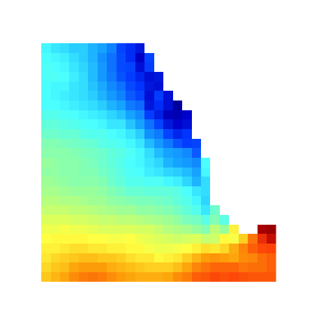
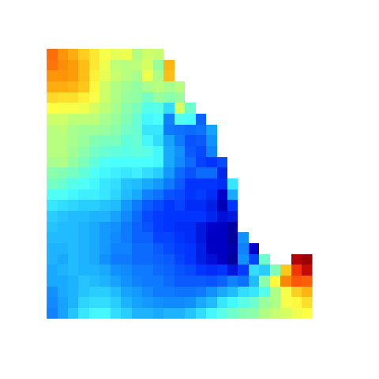

```{r setup, include=FALSE}
knitr::opts_chunk$set(echo = FALSE, cache=FALSE, fig.align="center")
library(knitr)
library(ggplot2)
library(factoextra)
library(dplyr)
source(file.path(here::here(), "R", "imgVectortoRaster.R"))
```

## Test 1

$$
a=h
$$

## R Markdown

$$
  \overbrace{
  \left(\begin{array}{ccc}
    p_{1,1}  & p_{1,2} & p_{1,3}  & p_{1,4}\\
    \hline
    p_{2,1}  & p_{2,2} & p_{2,3}  & p_{2,4}\\
    p_{3,1}  & p_{3,2} & p_{3,3}  & p_{3,4}\\
    p_{4,1}  & p_{4,2} & p_{4,3}  & p_{4,4}
  \end{array}\right)}^{\text{data}\,\,(N \times p)}
  =
  \overbrace{
  \left(\begin{array}{ccc}
    \alpha_{1,1}  & \alpha_{1,2} & \alpha_{1,3}\\
    \hline
    \alpha_{2,1}  & \alpha_{2,2} & \alpha_{2,3}\\
    \alpha_{3,1}  & \alpha_{3,2} & \alpha_{3,3}\\
    \alpha_{4,1}  & \alpha_{4,2} & \alpha_{4,3}
  \end{array}\right)}^{\text{PC}\,\,(N \times q)}
  \overbrace{\underbrace{
  \left[\begin{array}{cccc}
    \lambda_{1,1}  & \lambda_{1,2} & \lambda_{1,3} & \lambda_{1,4}\\
    \hline
    \lambda_{2,1}  & \lambda_{2,2} & \lambda_{2,3} & \lambda_{2,4}\\
    \lambda_{3,1}  & \lambda_{3,2} & \lambda_{3,3} & \lambda_{3,4}
  \end{array}\right]}_{p \text{ eigenimages}}}^{q\,\,\text{eigen images}\,\,(q \times p)}
$$

$$
\underbrace{\mathbf{X}}_{\text{data}}= \underbrace{\mathbf{U}\,\,\,\,\,\,\,\,\,\mathbf{D}}_{\text{PC }
}\underbrace{\mathbf{V}^\top}_{\text{eigenimages}}
$$

##

image =  $\alpha_1 \times$  + $\alpha_2 \times$  + $\alpha_3 \times$  + $\dots$


##

$$
\begin{array}{cccc}
&
& \rotatebox{90}{bidule}
& \rotatebox{90}{machin}
& \rotatebox{90}{chose}\\
\hline
truc & 1 & 2 & 3 \\
\hline
\hline
truc & 1 & 2 & 3 \\
\hline
truc & 1 & 2 & 3 \\
\hline
\end{array}
$$

<div id="footer">
<table class="fTable">
<tr>
<td>Intro</td><td>PCA</td><td id="current">K-means</td><td>H-clusters</td><td>Summary</td>
</tr>
</div>