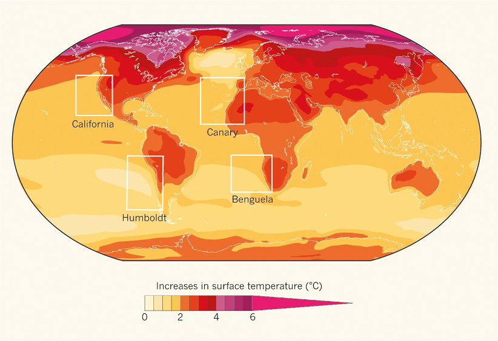
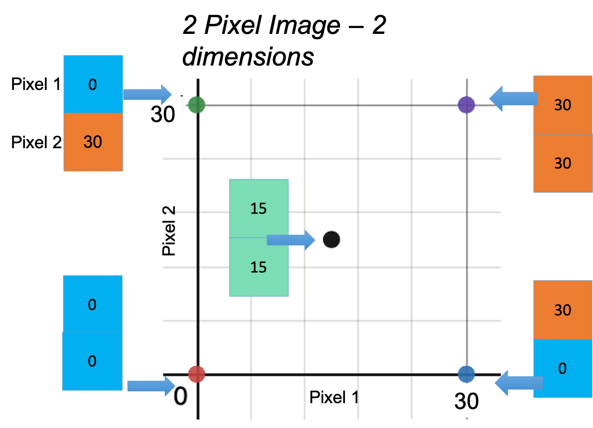

```{r setup, include=FALSE}
knitr::opts_chunk$set(echo = FALSE, cache=TRUE, fig.align="center", message=FALSE)
library(knitr)
library(ggplot2)
library(factoextra)
library(dplyr)
library(tidyr)
library(raster)
library(tmap)
library(png)
library(gridExtra)
library(dendextend)
library(DescTools)
source(file.path(here::here(), "R", "imgVectortoRaster.R"))
source(file.path(here::here(), "R", "dendIMG.R"))
source(file.path(here::here(), "R", "myheatmap.R"))
source(file.path(here::here(), "R", "desat.R"))
source(file.path(here::here(), "R", "kheatmap.R"))
source(file.path(here::here(), "R", "addIMGtopanel.R"))
source(file.path(here::here(), "R", "yearTable.R"))
# Code to download data from ERDDAP servers is in data folder
```

## Topics

* Motivation for this study
* Brief intro to upwelling patterns
* Common types of unsupervised image classification
  * PCA
  * K-means
  * Hierarchical clustering
* Seasonal patterns of upwelling revealed by image classification
* Changes in upwelling in the SEAS

##

{width=100%}


## Why Southeast coast of India?

<b>2014-2019</b> NOAA Fisheries/India Ministry of Earth Sciences joint research on improving forecasts of the indian oil sardine

* Hugely important fishery for India. 
* India fishery produces 66–96% (average 80%) of the global oil sardine catch. 
* Southeastern Arabian Sea (Kerala) produces the vast majority of that.
* I know a lot about this upwelling system, so good place to start.

<font style="color:blue">Improving forecasts using environmental covariates: a case study on the Indian oil sardine (Sardinella longiceps), May 24th, UW Fish and Wildlife Ecology Seminars.</font>

<div id="footer">
<table class="fTable">
<tr>
<td id="current">Intro</td><td>PCA</td><td>K-means</td><td>H-clusters</td><td>Summary</td>
</tr></table></div>


## {data-background="images/incois-cmlre-map-2.png"}

<div style="background-color: white">
<font size="6">Southeast Arabian Sea (SEAS) off the coast of Kerala state. ca 350 miles of coastline. Dispersed non-motorized and motorized fishery. Very productive fishing region for India.</font>
</font>
</div>

<div id="footer">
<table class="fTable">
<tr>
<td id="current">Intro</td><td>PCA</td><td>K-means</td><td>H-clusters</td><td>Summary</td>
</tr></table></div>

## Productivity in the SEAS is driven by seasonal upwelling

<div class="columns-2">
  {width=100%}
Summer monsoon brings wind and rain

  {width=100%}
Strong upwelling starts from the tip and moves north
</div>

<div id="footer">
<table class="fTable">
<tr>
<td id="current">Intro - SEAS</td><td>PCA</td><td>K-means</td><td>H-clusters</td><td>Summary</td>
</tr></table></div>

  
## Coastal upwelling leads to a characteristic SST differential

<center>
{width=60%}
</center>

* Nutrient rich water brought to the surface
* Phytoplankton blooms
* **Sea surface temperature (SST) differential**: Cold water along the coast and warm water off-shore

<div id="footer">
<table class="fTable">
<tr>
<td id="current">Intro - upwelling</td><td>PCA</td><td>K-means</td><td>H-clusters</td><td>Summary</td>
</tr></table></div>

##

<iframe width="720" height="480" src="images/Kochin_SST_2014-17_4x4.mp4" align="middle" frameborder="0" allowfullscreen></iframe>

<div id="footer">
<table class="fTable">
<tr>
<td id="current">Intro - upwelling</td><td>PCA</td><td>K-means</td><td>H-clusters</td><td>Summary</td>
</tr></table></div>

## Coastal upwelling patterns are expected to change

Land warms faster than the ocean -> changes in coastal winds

```{r, fig.align="center", out.width="60%", fig.cap="Projected warming between 2015 and 2050"}

```

<font size="3"> 
Di Lorenzo, E. 2015. The future of coastal ocean upwelling. Nature 518, 310–311.
</font>

<div id="footer">
<table class="fTable">
<tr>
<td id="current">Intro - upwelling</td><td>PCA</td><td>K-means</td><td>H-clusters</td><td>Summary</td>
</tr></table></div>

## 

<div class="columns-2">

### Can we use unsupervised image classification of sea surface temperature (SST) to study upwelling patterns and changes to those patterns?

{width=100%}

</div>

<div id="footer">
<table class="fTable">
<tr>
<td id="current">Intro - image classification</td><td>PCA</td><td>K-means</td><td>H-clusters</td><td>Summary</td>
</tr></table></div>


## Why unsupervised classification?

* I am looking for change not a specific pattern
* I am looking for novel patterns because things are changing
* I worked with other upwelling metrics a lot and am looking for new approaches.

<center>
<div style="float:right">
{width=40%}
{width=40%}
</div>
</center>

<div id="footer">
<table class="fTable">
<tr>
<td id="current">Intro - image classification</td><td>PCA</td><td>K-means</td><td>H-clusters</td><td>Summary</td>
</tr></table></div>


## Today's seminar

### Three types of unsupervised image classification

* Principal Components Analysis (PCA) or Empirical Othogonal Factorization (EOF)
* K-means clustering
* Hierarchical clustering

I also looked at density-based clustering but didn't have much success there.

### Changes in the upwelling patterns in the SEAS

* I am looking at changes to the <font style="color:red">pattern</font> not absolute temperature
* Arabian Sea has warmed a lot in the past 2 decades. I have removed that by removing the mean from each image.
* I am showing **monthly** images in most of the talk, but at the end I will switch to **daily** when talking more about the SEAS changes

<div id="footer">
<table class="fTable">
<tr>
<td id="current">Intro</td><td>PCA</td><td>K-means</td><td>H-clusters</td><td>Summary</td>
</tr></table></div>


## Working with images

* An image has $p$ pixels
* Each row is an image. Each column is a pixel. 
* Get rid of the NA (land) columns. No NAs allowed otherwise.
* Values are temperature with the mean temperature in that image subtracted. In some applications, you would standardize the variance to 1.

Here are 5 images and just the first 10 pixels of the image.

```{r echo=FALSE}
# Data
datafile <- file.path(here::here(), "data", "SEAS-monthly-sst.RData")
load(datafile)
datalist <- out
# Data for clustering functions
Data_clean <- out$dat.clean
Data_dirty <- out$dat
pos_loc <- out$pos.loc
X <- Data_clean[c(-1,-2),] - 273.15 #Kelvin in ERA5
dates <- as.Date(rownames(X))
years <- as.numeric(format(dates, "%Y"))
X_norm <- t(scale(t(X), scale=FALSE))
colnames(X_norm) <- colnames(X) <- paste0("p", 1:ncol(X_norm))
dates <- as.Date(rownames(X))
years <- as.numeric(format(dates, "%Y"))
mons <- format(dates, "%B")
yearrange <- min(years):max(years)
```

```{r echo=FALSE}
round(X_norm[1:5, 1:10], digits=2)
```

<div id="footer">
<table class="fTable">
<tr>
<td id="current">Intro - images</td><td>PCA</td><td>K-means</td><td>H-clusters</td><td>Summary</td>
</tr></table></div>

## PCA (and EOF)

* Each image (a data set with $p$ variables) can be expressed as the weighted sum of orthogonal images (i.e. independent).
* The vector is length $p$ (number of pixels)
* The first vector captures most of the variance in the images.

$$\text{image} = \alpha_1 \lambda_1 + \alpha_2 \lambda_2 + \alpha_3 \lambda_3 + \dots$$
*For those familiar with singular value decomposition*
$$
\underbrace{\mathbf{X}}_{\text{data}}= \underbrace{\mathbf{U}\,\,\mathbf{D}}_{\alpha}
\underbrace{\mathbf{V}^\top}_{\lambda}
$$
<div id="footer">
<table class="fTable">
<tr>
<td>Intro</td><td id="current">PCA - overview</td><td>K-means</td><td>H-clusters</td><td>Summary</td>
</tr></table></div>

## Classic example is facial recognition: eigenfaces

<center>
{width=75%}
{width=75%}
</center>

<div id="footer">
<table class="fTable">
<tr>
<td>Intro</td><td id="current">PCA - overview</td><td>K-means</td><td>H-clusters</td><td>Summary</td>
</tr></table></div>


## PCA and EOF also used in oceanography

Pacific Decadal Oscillation index is an example. It is the weighting ($\alpha$) on the first $\lambda$ from gridded SST anomalies in the North Pacific.

<div id="footer">
<table class="fTable">
<tr>
<td>Intro</td><td id="current">PCA - overview</td><td>K-means</td><td>H-clusters</td><td>Summary</td>
</tr></table></div>


## Let's see how to do it

<!--
With Singular Value Decomposition:
```{r echo=TRUE}
pca <- svd(X_norm) #singular value decomposition
eigenimages <- t(pca$v)
rownames(eigenimages) <- paste0("lambda", 1:nrow(eigenimages))
alpha <- pca$u %*% diag(pca$d)
colnames(alpha) <- paste0("PC", 1:ncol(alpha))
```
-->

Let's use `prcomp` in R. Using `prcomp` means you can use the visualization tools in R for PCA.
```{r echo=TRUE}
prcomp.pca <- prcomp(X_norm, scale = FALSE, center=FALSE)
```

```{r}
# Do this so the first image looks like upwelling
prcomp.pca$rotation[,1] <- -1*prcomp.pca$rotation[,1]
prcomp.pca$x[,1] <- -1*prcomp.pca$x[,1]
# Store for use later
eigenimages <- t(prcomp.pca$rotation)
alpha <- prcomp.pca$x
```

```{r echo=FALSE, warning=FALSE}
# Set up the data frame
library(tidyr)
df <- data.frame(alpha,
                date=as.Date(rownames(X_norm)),
                year=as.integer(format(as.Date(rownames(X_norm)), "%Y")),
                mon=factor(format(as.Date(rownames(X_norm)), "%b"), levels=month.abb),
                decade=cut(as.integer(format(as.Date(rownames(X_norm)), "%Y")), breaks=seq(1970,2020,10), labels=c("71-80", "81-90", "91-00", "01-10", "11-20")))
df2 = pivot_longer(df, starts_with("PC"), names_to="PC", values_to="value")
```

* The $\lambda$ are in `prcomp.pca$rotation` with each column an "eigen image".
* The $\alpha$ are in `prcomp.pca$x`. One for each image and each $\lambda$.

<div id="footer">
<table class="fTable">
<tr>
<td>Intro</td><td id="current">PCA - sst images</td><td>K-means</td><td>H-clusters</td><td>Summary</td>
</tr></table></div>

##

Eigen images. Just first 10 pixels of the image are shown.
```{r echo=TRUE}
eigenimages <- t(prcomp.pca$rotation)
round(eigenimages[1:5, 1:10], digits=2)
```

```
# if image is say 25x25
library(raster)
img <- as.raster(matrix(eigenimages[1,], byrow=TRUE, ncol=25))
plot(img)
```

<div id="footer">
<table class="fTable">
<tr>
<td>Intro</td><td id="current">PCA - sst images</td><td>K-means</td><td>H-clusters</td><td>Summary</td>
</tr></table></div>

##

```{r echo=FALSE, message=FALSE, warning=FALSE}
img.list <- imgVectortoRaster(eigenimages, datalist)$list
```

<center>
```{r echo=FALSE, message=FALSE, warning=FALSE}
p_stack <- raster::stack(img.list[[1]], img.list[[2]], img.list[[3]], 
                 img.list[[4]], img.list[[5]], img.list[[6]])
library(tmap)
pal <- colorRamps::matlab.like(100)
tm_shape(p_stack) + 
  tm_raster(style= "cont", title="SST Anomaly", 
            palette=pal, midpoint=NA, 
            colorNA = "grey", textNA = "Land") +
  tm_layout(panel.labels = paste("PC", 1:length(p_stack))) +
  tm_layout(main.title = "Eigen Images", title.size = 1)
```
</center>

<div id="footer">
<table class="fTable">
<tr>
<td>Intro</td><td id="current">PCA - eigen images</td><td>K-means</td><td>H-clusters</td><td>Summary</td>
</tr></table></div>


## Reconstructing the SST images

```{r message=FALSE, warning=FALSE, eval=FALSE}
library(png)
library(raster)
for(i in 1:6){
png(filename=paste0("images/eigen",i,".png"))
plot(img.list[[i]], legend=FALSE, axes=FALSE, box=FALSE, col=pal)
dev.off()
}
```

<!--
$$\text{image} = \alpha_1 \lambda_1 + \alpha_2 \lambda_2 + \alpha_3 \lambda_3 + \dots$$
-->

image =  $\alpha_1 \times$  + $\alpha_2 \times$  + $\alpha_3 \times$  + $\dots$


```{r}
#reconstruction
ncomp1 <- 1
RE1 <- alpha[,1:ncomp1, drop=FALSE] %*% eigenimages[1:ncomp1,, drop=FALSE]
ncomp2 <- 2
RE2 <- alpha[,1:ncomp2] %*% eigenimages[1:ncomp2,]
ncomp3 <- 10
RE3 <- alpha[,1:ncomp3] %*% eigenimages[1:ncomp3,]
```

<div id="footer">
<table class="fTable">
<tr>
<td>Intro</td><td id="current">PCA - reconstuction</td><td>K-means</td><td>H-clusters</td><td>Summary</td>
</tr></table></div>


## August

```{r echo=FALSE}
i <- which(rownames(X_norm)=="1987-08-01")
img1 <- imgVectortoRaster(rbind(X_norm[i,], RE1[i,], RE2[i,], RE3[i,]), datalist)$stack
tm_shape(img1) + 
  tm_raster(style= "cont", title="SST Anomaly", 
            palette=pal, midpoint=NA, 
            colorNA = "grey", textNA = "Land") +
  tm_layout(panel.labels = c("True", paste(c(ncomp1, ncomp2, ncomp3),"PC")),
            title=rownames(X_norm)[i])
```

<div id="footer">
<table class="fTable">
<tr>
<td>Intro</td><td id="current">PCA - reconstuction</td><td>K-means</td><td>H-clusters</td><td>Summary</td>
</tr></table></div>

## March

```{r echo=FALSE}
i <- which(rownames(X_norm)=="1987-03-01")
img1 <- imgVectortoRaster(rbind(X_norm[i,], RE1[i,], RE2[i,], RE3[i,]), datalist)$stack
tm_shape(img1) + 
  tm_raster(style= "cont", title="SST Anomaly", 
            palette=pal, midpoint=NA, 
            colorNA = "grey", textNA = "Land") +
  tm_layout(panel.labels = c("True", paste(c(ncomp1, ncomp2, ncomp3),"PC")),
            title=rownames(X_norm)[i])
```

<div id="footer">
<table class="fTable">
<tr>
<td>Intro</td><td id="current">PCA - reconstuction</td><td>K-means</td><td>H-clusters</td><td>Summary</td>
</tr></table></div>


## May

```{r echo=FALSE}
i <- which(rownames(X_norm)=="1987-05-01")
img1 <- imgVectortoRaster(rbind(X_norm[i,], RE1[i,], RE2[i,], RE3[i,]), datalist)$stack
tm_shape(img1) + 
  tm_raster(style= "cont", title="SST Anomaly", 
            palette=pal, midpoint=NA, 
            colorNA = "grey", textNA = "Land") +
  tm_layout(panel.labels = c("True", paste(c(ncomp1, ncomp2, ncomp3),"PC")),
            title=rownames(X_norm)[i])
```

<div id="footer">
<table class="fTable">
<tr>
<td>Intro</td><td id="current">PCA - reconstuction</td><td>K-means</td><td>H-clusters</td><td>Summary</td>
</tr></table></div>

## Variance (in data set) explained

```{r}
fviz_eig(prcomp.pca) + xlab("Principal Components") + ggtitle("")
```

<div id="footer">
<table class="fTable">
<tr>
<td>Intro</td><td id="current">PCA - explained variance</td><td>K-means</td><td>H-clusters</td><td>Summary</td>
</tr></table></div>

## SST Anomaly pattern in the PC1-PC2 space

```{r echo=FALSE, warning=FALSE}
wid <- 1.25
p <- ggplot(df, aes(x=PC1, y=PC2)) + geom_point(col=NA)
xs <- seq(min(df$PC1)+.2*wid,max(df$PC1), 2.2*wid)
ys <- seq(min(df$PC2)+.2*wid,max(df$PC2), 2.2*wid)
for(i in xs){
  for(j in ys){
  x <- c(i, j)
    img.list <- imgVectortoRaster(t(prcomp.pca$rotation[,1:2] %*% matrix(x, ncol=1)), datalist)$list
    img <- raster::as.raster(img.list[[1]])
    img[is.na(img)] <- "#808080"
    g <- grid::rasterGrob(img, interpolate=TRUE)
    p <- p +
      annotation_custom(g, xmin=x[1]-wid, xmax=x[1]+wid, ymin=x[2]-wid, ymax=x[2]+wid)
  }
}
p + 
  geom_hline(yintercept=0) +
  geom_vline(xintercept=0)
```   

<div id="footer">
<table class="fTable">
<tr>
<td>Intro</td><td id="current">PCA - PC 1&2</td><td>K-means</td><td>H-clusters</td><td>Summary</td>
</tr></table></div>

##

```{r echo=FALSE, warning=FALSE}
fviz_pca_ind(prcomp.pca,
             col.ind = factor(format(as.Date(rownames(X_norm)), "%B"), levels=month.name),
             geom="point",
             addEllipses=TRUE
             ) + ggtitle("PC1/PC1 loadings (+ = upwelling) by month")
```

<div id="footer">
<table class="fTable">
<tr>
<td>Intro</td><td id="current">PCA - seasonal pattern</td><td>K-means</td><td>H-clusters</td><td>Summary</td>
</tr></table></div>

## 1980s versus 2010s

```{r echo=FALSE, warning=FALSE}
p <- ggplot(subset(df, decade%in%c("81-90","11-20")), aes(x=PC1, y=PC2, col=decade)) +
  geom_point() +
  geom_hline(yintercept=0) +
  geom_vline(xintercept=0) +
  facet_wrap(~mon) +
  ggtitle("1980s versus 2010s")
p
```

<div id="footer">
<table class="fTable">
<tr>
<td>Intro</td><td id="current">PCA - upwelling changes</td><td>K-means</td><td>H-clusters</td><td>Summary</td>
</tr></table></div>


##

```{r echo=FALSE}
p <- ggplot(subset(df2, PC %in% c("PC1")), aes(x=date, y=value, fill=value>0)) +
  geom_col(width=300) +
  facet_wrap(~mon) +
  xlab("") +
  theme(axis.text.x = element_text(angle = 90, vjust = 0.5, hjust=1),
        legend.position = "none") +
  ggtitle("PC1 loadings")

p
```

<div id="footer">
<table class="fTable">
<tr>
<td>Intro</td><td id="current">PCA - upwelling changes</td><td>K-means</td><td>H-clusters</td><td>Summary</td>
</tr></table></div>

##

```{r echo=FALSE}
df3 <- subset(df2, PC %in% c("PC1"))
df3 <- df3 %>% group_by(mon) %>%
  mutate(center=value-mean(value),
         mean=mean(value))
df3$lab <- factor(paste(df3$mon, round(df3$mean, digits=2)),
                  levels=paste(month.abb, round(tapply(df3$mean, df3$mon, unique), digits=2)))
                  
p <- ggplot(df3, aes(x=date, y=center, fill=center>0)) +
  geom_col(width=300) +
  facet_wrap(~lab) +
  xlab("") +
  theme(axis.text.x = element_text(angle = 90, vjust = 0.5, hjust=1),
        legend.position = "none") +
  ggtitle("PC1 loadings relative to mean")

p
```

<div id="footer">
<table class="fTable">
<tr>
<td>Intro</td><td id="current">PCA - upwelling changes</td><td>K-means</td><td>H-clusters</td><td>Summary</td>
</tr></table></div>

## Sep and Aug seem to be changing

```{r warning=FALSE, message=FALSE}
ncomp <- 1:2
df4 <- subset(df2, PC %in% paste0("PC", ncomp))
df4$PC <- factor(df4$PC, level=paste0("PC", ncomp))
df4 <- df4 %>% group_by(PC, mon) %>%
  mutate(mean=mean(value),
         err=value-mean)
df5 <- df4 %>% group_by(mon, date) %>% 
  summarize(distance=sqrt(sum(err^2)))
```

```{r}
ggplot(df5, aes(x=date, y=distance)) + geom_point() +
  geom_smooth(span = 0.9) + xlab("") + 
  theme(axis.text.x = element_text(angle = 45, vjust = 1, hjust=1)) +
  ggtitle("Distance moved in PC1-PC2 space") +
  facet_wrap(~mon)
```

<div id="footer">
<table class="fTable">
<tr>
<td>Intro</td><td id="current">PCA - upwelling changes</td><td>K-means</td><td>H-clusters</td><td>Summary</td>
</tr></table></div>

## August images

<center>
```{r}
loc <- which(rownames(X_norm)%in%paste0(1980:2019,"-08-01"))
img1 <- imgVectortoRaster(X_norm[loc,], datalist)$stack
tm_shape(img1) + 
  tm_raster(style= "cont", title="SST Anomaly", 
            palette=pal, midpoint=NA, 
            colorNA = "grey", textNA = "Land") +
  tm_layout(panel.labels = rownames(X_norm)[loc])
```
</center>

<div id="footer">
<table class="fTable">
<tr>
<td>Intro</td><td id="current">PCA - upwelling changes</td><td>K-means</td><td>H-clusters</td><td>Summary</td>
</tr></table></div>


## Outlier identification

Use the first 10 dimensions.

```{r warning=FALSE, message=FALSE}
ncomp <- 1:10
df4 <- subset(df2, PC %in% paste0("PC", ncomp))
df4$PC <- factor(df4$PC, level=paste0("PC", ncomp))
df4 <- df4 %>% group_by(PC, mon) %>%
  mutate(mean=mean(value),
         err=value-mean)
df5 <- df4 %>% group_by(mon, date) %>% 
  summarize(distance=sqrt(sum(err^2)))
```

```{r}
ggplot(df5, aes(x=date, y=distance)) + geom_point() +
  geom_smooth(span = 0.9) + xlab("") + 
  theme(axis.text.x = element_text(angle = 45, vjust = 1, hjust=1)) +
  ggtitle("Distance moved in PC 1 to 10 space") +
  facet_wrap(~mon)
```

<div id="footer">
<table class="fTable">
<tr>
<td>Intro</td><td id="current">PCA - upwelling changes</td><td>K-means</td><td>H-clusters</td><td>Summary</td>
</tr></table></div>

## March images

<center>
```{r}
loc <- which(rownames(X_norm)%in%paste0(1980:2019,"-03-01"))
img1 <- imgVectortoRaster(X_norm[loc,], datalist)$stack
tm_shape(img1) + 
  tm_raster(style= "cont", title="SST Anomaly", 
            palette=pal, midpoint=NA, 
            colorNA = "grey", textNA = "Land") +
  tm_layout(panel.labels = rownames(X_norm)[loc])
```
</center>

<div id="footer">
<table class="fTable">
<tr>
<td>Intro</td><td id="current">PCA - upwelling changes</td><td>K-means</td><td>H-clusters</td><td>Summary</td>
</tr></table></div>


## K-means clustering

<center>
{width=100%}
</center>

<div id="footer">
<table class="fTable">
<tr>
<td>Intro</td><td>PCA</td><td id="current">K-means - intro</td><td>H-clusters</td><td>Summary</td>
</tr></table></div>

##

<center>
{width=90%}
</center>

<div id="footer">
<table class="fTable">
<tr>
<td>Intro</td><td>PCA</td><td id="current">K-means - intro</td><td>H-clusters</td><td>Summary</td>
</tr></table></div>

##

<center>
{width=90%}
</center>

<div id="footer">
<table class="fTable">
<tr>
<td>Intro</td><td>PCA</td><td id="current">K-means - intro</td><td>H-clusters</td><td>Summary</td>
</tr></table></div>

##

<center>
{width=90%}
</center>

<div id="footer">
<table class="fTable">
<tr>
<td>Intro</td><td>PCA</td><td id="current">K-means - intro</td><td>H-clusters</td><td>Summary</td>
</tr></table></div>

## Let's try it

We need to choose the number of centers. I will start with 12 --- big enough to capture most of the variability (which I discovered through trial and error).

```{r echo=TRUE}
set.seed(1221966)
n_K <- 12
out_norm <- kmeans(X_norm, n_K, iter.max=25, nstart=100)
```

* The centroid images are in `out$centers`. Each row is an image.

```{r echo=FALSE}
centroidimages_norm <- out_norm$centers
rownames(centroidimages_norm) <- paste("Centroid", 1:n_K)
```

<div id="footer">
<table class="fTable">
<tr>
<td>Intro</td><td>PCA</td><td id="current">K-means - sst images</td><td>H-clusters</td><td>Summary</td>
</tr></table></div>

##

```{r echo=FALSE, message=FALSE, warning=FALSE}
img_norm <- imgVectortoRaster(centroidimages_norm, datalist)
img.stack.norm <- img_norm$stack
img.list.norm <- img_norm$list
```

<center>
```{r echo=FALSE, message=FALSE, warning=FALSE}
library(tmap)
pal <- colorRamps::matlab.like(100)
tm_shape(img.stack.norm) + 
  tm_raster(style= "cont", title="SST Anomaly", 
            palette=pal, midpoint=NA, 
            colorNA = "grey", textNA = "Land") +
  tm_layout(panel.labels = paste("Centroid", 1:length(p_stack))) +
  tm_layout(main.title = "Centroid Images", title.size = 1)
```
</center>

<div id="footer">
<table class="fTable">
<tr>
<td>Intro</td><td>PCA</td><td id="current">K-means - centroids</td><td>H-clusters</td><td>Summary</td>
</tr></table></div>

## Distances between the images

Distance based on Euclidian distance. 

```{r warning=FALSE}
p12 <- kheatmap(12, X_norm, datalist, main.n=5, plotit=FALSE, dend.type="original")
```

<div id="footer">
<table class="fTable">
<tr>
<td>Intro</td><td>PCA</td><td id="current">K-means - distance</td><td>H-clusters</td><td>Summary</td>
</tr></table></div>


## Seasonal heat map

```{r message=FALSE}
p12$heatmap
```


<div id="footer">
<table class="fTable">
<tr>
<td>Intro</td><td>PCA</td><td id="current">K-means - heatmap</td><td>H-clusters</td><td>Summary</td>
</tr></table></div>

## Different number of centers


Darker colors equals more variance. So if upwelling = stronger differential.

```{r include=FALSE, warning=FALSE}
p5 <- kheatmap(5, X_norm, datalist, main.n=5, plotit=FALSE)$heatmap
p12 <- kheatmap(12, X_norm, datalist, main.n=5, plotit=FALSE)$heatmap
p18 <- kheatmap(18, X_norm, datalist, main.n=5, plotit=FALSE)$heatmap
p22 <- kheatmap(22, X_norm, datalist, main.n=5, plotit=FALSE)$heatmap
```

```{r echo=FALSE}
library(gridExtra)
thm <- theme(legend.position = "none", axis.title = element_blank(), axis.text = element_blank())
add <- geom_hline(yintercept=6, col="red", alpha=0.3)
add2 <- annotate("text", 2022, 1:12, label=stringr::str_sub(month.abb,1,1), hjust=0)
add3 <- annotate("text", c(1985, 1985, 2005, 2000), c(3.5, 6, 8, 11), 
                 label=c("cold N tongue", "cold tip", "upwelling", "uniform"), 
                 color=c("black", "white", "black", "black"))
grid.arrange(p5+thm+ggtitle("K = 5")+add+add3,
             p12+thm+ggtitle("K = 12")+add+add2+add3,
             p18+thm+ggtitle("K = 18")+add+add3,
             p22+thm+ggtitle("K = 22")+add+add2+add3)
```


<div id="footer">
<table class="fTable">
<tr>
<td>Intro</td><td>PCA</td><td id="current">K-means - heatmap</td><td>H-clusters</td><td>Summary</td>
</tr></table></div>

## Overall pattern

* How the pattern is changing depends somewhat on how may centers (how fine a scale).
* July and August have upwelling patterns but differential is stronger
* September is more variable in the last decade
* October hard to place in a group (moves around depending on number of centers)
* May also different in first versus second half
* **Transition** months

<div id="footer">
<table class="fTable">
<tr>
<td>Intro</td><td>PCA</td><td id="current">K-means - heatmap</td><td>H-clusters</td><td>Summary</td>
</tr></table></div>


## Changes within months?

```{r}
df <- c()
for(mon in 1:12){
  i <- c(paste0("0",1:9),10:12)[mon]
  n <- 2
  dat <- X_norm
  loc <- which(rownames(X_norm)%in%paste0(yearrange,"-",i,"-01"))
  aug <- kmeans(dat[loc,], n, iter.max=25, nstart=100)
  x <- paste0("C", aug$cluster)
  tmp <- data.frame(date=as.Date(rownames(X_norm)[loc]), 
                    month=month.abb[mon], cluster=x, p.value=NA)
  #reticulate::py_run_string("pval=runs_test(r.x)")
  for(j in 1:n) tmp[x==paste0("C",j), "p.value"] <- DescTools::RunsTest(x==paste0("C",j), exact=TRUE)$p.value
    #tmp[x==paste0("C",j), "p.value"] <- tseries::runs.test(factor(x==paste0("C",j)), alternative="greater")$p.value
  df <- rbind(df, tmp)
}
df$month <- factor(df$month, levels=month.abb)
ggplot(df, aes(x=date, y=cluster, col=p.value<0.05)) + geom_point() + facet_wrap(~month) + ggtitle(paste(n,"centers for each month with randomness test")) +
  xlab("") +
  theme(axis.text.x = element_text(angle = 90, vjust = 0.5, hjust=1))
```

## Raw temperature patterns

```{r}
p12 <- kheatmap(12, X, datalist, main.n=4, sub.n=6, plotit=FALSE, ramp="mean", ramp.type=1, dend.type="mean0")
```

<div id="footer">
<table class="fTable">
<tr>
<td>Intro</td><td>PCA</td><td id="current">K-means - seasonal</td><td>H-clusters</td><td>Summary</td>
</tr></table></div>

## Raw temperature seasonal pattern

Blue (colder) and green (warmer) are upwelling patterns. Red (hot) and orange (warm) are uniform patterns. Grey is cold at the tip of India.

```{r}
p12$heatmap
```

<div id="footer">
<table class="fTable">
<tr>
<td>Intro</td><td>PCA</td><td id="current">K-means - seasonal</td><td>H-clusters</td><td>Summary</td>
</tr></table></div>

## Hierarchical clustering

<center>

</center>

<div id="footer">
<table class="fTable">
<tr>
<td>Intro</td><td>PCA</td><td id="current">K-means - seasonal</td><td>H-clusters</td><td>Summary</td>
</tr></table></div>


## Let's try it!

* I am going to cluster on the raw images, but later I will be clustering on the Principal Components so that I have orthogonal variables.
* I am also going to use Euclidian distance. I've tried a bunch. At this point, I don't see that huge of a difference.

```{r echo=TRUE}
ncomp <- 20
d <- dist(X_norm, method = "euclidian")
clus <- hclust(d)
```

<div id="footer">
<table class="fTable">
<tr>
<td>Intro</td><td">PCA</td><td>K-means</td><td id="current>H-clusters - example</td><td>Summary</td>
</tr></table></div>

## `method="ward.D2"` default

This method tries to make compact clusters of similar size.

```{r}
clus <- hclust(d, method="ward.D2")
dend <- as.dendrogram(clus)
nodePar <- list(lab.cex = 0.6, pch = c(NA, 19), 
                cex = 0.2, col = "blue")
library(dendextend)
dend %>%
  set("labels_col", value = c("skyblue", "orange", "grey","red", "black"), k=3) %>%
  set("branches_k_color", value = c("skyblue", "orange", "grey", "red", "black"), k = 3) %>%
  plot(horiz=TRUE, axes=FALSE, ylab = "", xlab="Distance", 
     nodePar = nodePar, leaflab = "none", main="method='ward.D2'")
```

<div id="footer">
<table class="fTable">
<tr>
<td>Intro</td><td">PCA</td><td>K-means</td><td id="current>H-clusters - ward</td><td>Summary</td>
</tr></table></div>

## `method="complete"` default

This method allows you to find outliers.

```{r}
clus <- hclust(d)
dend <- as.dendrogram(clus)
nodePar <- list(lab.cex = 0.6, pch = c(NA, 19), 
                cex = 0.2, col = "blue")
library(dendextend)
dend %>%
  set("labels_col", value = c("skyblue", "orange", "grey","red", "black"), k=5) %>%
  set("branches_k_color", value = c("skyblue", "orange", "grey", "red", "black"), k = 5) %>%
  plot(horiz=TRUE, axes=FALSE, ylab = "", xlab="Distance", 
     nodePar = nodePar, leaflab = "none", main="method='complete'")
```

<div id="footer">
<table class="fTable">
<tr>
<td>Intro</td><td">PCA</td><td>K-means</td><td id="current>H-clusters - complete</td><td>Summary</td>
</tr></table></div>

## `method="complete"` default

```{r}
K <- 5
clus <- hclust(d, method="complete")
sub_grp <- cutree(clus, k = K)
centers <- apply (X_norm, 2, function (x) tapply (x, sub_grp, mean))
img.list <- imgVectortoRaster(centers, datalist)$list
dendIMG(centers, img.list, lab.extra="none")
```
   
<div id="footer">
<table class="fTable">
<tr>
<td>Intro</td><td">PCA</td><td>K-means</td><td id="current>H-clusters - complete centroids</td><td>Summary</td>
</tr></table></div>

## `method="ward.D2"` 

```{r}
K <- 5
clus <- hclust(d, method="ward.D2")
sub_grp <- cutree(clus, k = K)
centers <- apply (X_norm, 2, function (x) tapply (x, sub_grp, mean))
img.list <- imgVectortoRaster(centers, datalist)$list
dendIMG(centers, img.list, lab.extra="none")
```

<div id="footer">
<table class="fTable">
<tr>
<td>Intro</td><td">PCA</td><td>K-means</td><td id="current>H-clusters - ward centroids</td><td>Summary</td>
</tr></table></div>

## Summary for hierarchical clustering

* Allows you to get a better understanding of the structure
* Overall not that different from patterns from k-means
* Does better than k-means at outlier identification using `method="complete"`

<div id="footer">
<table class="fTable">
<tr>
<td>Intro</td><td">PCA</td><td>K-means</td><td id="current>H-clusters - summary</td><td>Summary</td>
</tr></table></div>

## Changes in the SEAS

Daily SST from the NOAA IOSST data set. Interpolated daily data from AVHRR. Not so smooth as the ERA5 monthly data.

```{r echo=FALSE}
# Data
datafile <- file.path(here::here(), "data", "SEAS-daily-sst-1981-2020.RData")
load(datafile)
datalist <- out
# Data for clustering functions
Data_clean <- out$dat.clean
Data_dirty <- out$dat
pos_loc <- out$pos.loc
#X <- Data_clean[c(-1,-2),] - 273.15
X <- Data_clean[c(-1,-2),]
dates <- as.Date(rownames(X))
years <- as.numeric(format(dates, "%Y"))
X <- X[years>1981,]
X_norm <- t(scale(t(X), scale=FALSE))
colnames(X_norm) <- colnames(X) <- paste0("p", 1:ncol(X_norm))
dates <- as.Date(rownames(X))
years <- as.numeric(format(dates, "%Y"))
wks <- as.numeric(strftime(dates, format = "%V"))
mons <- format(dates, "%B")
yearrange <- min(years):max(years)
```

<center>
```{r}
loc <- which(rownames(X)%in%paste0(1980:2019,"-08-01"))
img1 <- imgVectortoRaster(X[loc,], datalist)$stack
tm_shape(img1) + 
  tm_raster(style= "cont", title="SST Anomaly", 
            palette=pal, midpoint=NA, 
            colorNA = "grey", textNA = "Land") +
  tm_layout(panel.labels = rownames(X_norm)[loc]) +
  ggtitle("August 1 images")
```
</center>

<div id="footer">
<table class="fTable">
<tr>
<td>Intro</td><td">PCA</td><td>K-means</td><td>H-clusters</td><td id="current>Summary - Daily images</td>
</tr></table></div>

## Demeaned data

<center>
```{r}
loc <- which(rownames(X)%in%paste0(1980:2019,"-08-01"))
img1 <- imgVectortoRaster(X_norm[loc,], datalist)$stack
tm_shape(img1) + 
  tm_raster(style= "cont", title="SST Anomaly", 
            palette=pal, midpoint=NA, 
            colorNA = "grey", textNA = "Land") +
  tm_layout(panel.labels = rownames(X_norm)[loc]) +
  ggtitle("August 1 images")
```
</center>

<div id="footer">
<table class="fTable">
<tr>
<td>Intro</td><td">PCA</td><td>K-means</td><td>H-clusters</td><td id="current>Summary - Daily images</td>
</tr></table></div>

## Jul-Sep number of days with upwelling signal

For speed purposes, I am going to use the first 20 Principal Components, so a 14245 $\timex$ 20 matrix instead of a 14245 $\times$ 443 matrix.

```{r}
prcomp.pca <- prcomp(X_norm, scale = FALSE, center=FALSE)
eigenimages <- t(prcomp.pca$rotation)
alpha <- prcomp.pca$x
```

```{r}
ncomp <- 20
monvals <- month.name[6:9]
for(meth in c("hclust.complete")){
  p1 <- yearTable(alpha[mons%in%monvals,1:ncomp], 
                  method=meth, K=3, 
                  dist.type="euclidian")
  #p <- p1$p+geom_smooth(method = "lm", se = TRUE)+ggtitle(meth)
  p <- p1$p + geom_smooth(span = 0.3)+
    ggtitle(paste0("Number of days in each pattern in June-Sept (", meth, ")"))
  centers <- p1$centers %*% eigenimages[1:ncomp,, drop=FALSE]
  img.list <- imgVectortoRaster(centers, datalist)$list
  addIMGtopanel(p, img.list)
}
```

<div id="footer">
<table class="fTable">
<tr>
<td>Intro</td><td">PCA</td><td>K-means</td><td>H-clusters</td><td id="current>Summary - SEAS changes</td>
</tr></table></div>

## Jul-Sep day of first and last strong upwelling signal

```{r}
library(tidyr)
grp_yrs <- years[mons%in%monvals]
grp_date <- format(as.Date(rownames(X)[mons%in%monvals]), "%b-%d")
first_day <- tapply(p1$clusters, grp_yrs, function(x){min(which(x==3))})
last_day <- tapply(p1$clusters, grp_yrs, function(x){max(which(x==3))})
df <- data.frame(year=as.numeric(names(first_day)), first_day=first_day, last_day=last_day, first_day2=grp_date[first_day], last_day2=grp_date[last_day])
df2 <- df[,1:3] %>% pivot_longer(cols = 2:3, names_to="upwelling", values_to="day")
ggplot(df2, aes(x=year, y=day, col=upwelling)) + 
  geom_line() + geom_smooth(method="lm") +  
  scale_y_continuous(breaks=seq(0,125,10),
        labels=c("", grp_date[1:122][seq(0,125,10)]))+
  ggtitle("First and last day of strong upwelling pattern")
```

<div id="footer">
<table class="fTable">
<tr>
<td>Intro</td><td">PCA</td><td>K-means</td><td>H-clusters</td><td id="current>Summary - SEAS changes</td>
</tr></table></div>

## Summary - Image Classification

Code

* GitHub: https://github.com/eeholmes/Upwelling-Image-Analysis
* talk in talk folder under QuanSeminar.Rmd


* PCA
    * Very helpful in reducing the dimensionality and taking care of spatial correlation
    * Not clear that PC1-PC2 space captures enough variation to be useful on its own
    * Need to retry with just June-Sept data
    * Distance from centroid might be useful...
    
* k-means and hierarchical clustering
    * Identifying specific cluster (centroid images) is very helpful
    * *Which image is most like xyz* seems like a promising approach

<div id="footer">
<table class="fTable">
<tr>
<td>Intro</td><td">PCA</td><td>K-means</td><td>H-clusters</td><td id="current>Summary</td>
</tr></table></div>

## Summary - Changes in the SEAS

* Image classification worked on the daily data! Daily is much noisier than monthly.
* It seems like the upwelling season is changing
   * shortening, or upwelling *width* is narrowing, or northern extent shrinking, or tip getting more intense
   * Observed this with other approaches also
* Rethink the image de-meaning and scaling (lack thereof)
   * SST has warmed a lot, 1 to 1.5 degrees
   
```{r sst.up, fig.height=2}
mon <- "April"
a=tapply(apply(X[mons==mon,],1,mean), years[mons==mon],mean)
df <- data.frame(year=unique(years[mons=="May"]), temp=a)
ggplot(df, aes(x=year, y=temp)) + geom_line() + xlab("") + ylab("temperature") +
  ggtitle(paste("mean", mon, "temperature"))
```

<div id="footer">
<table class="fTable">
<tr>
<td>Intro</td><td">PCA</td><td>K-means</td><td>H-clusters</td><td id="current>Summary</td>
</tr></table></div>

## {data-background="images/IMG_3389.JPG"}

### eli.holmes@noaa.gov
### github.com/eeholmes
### eeholmes.github.io


