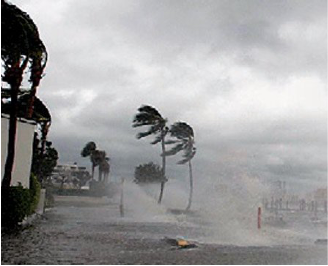
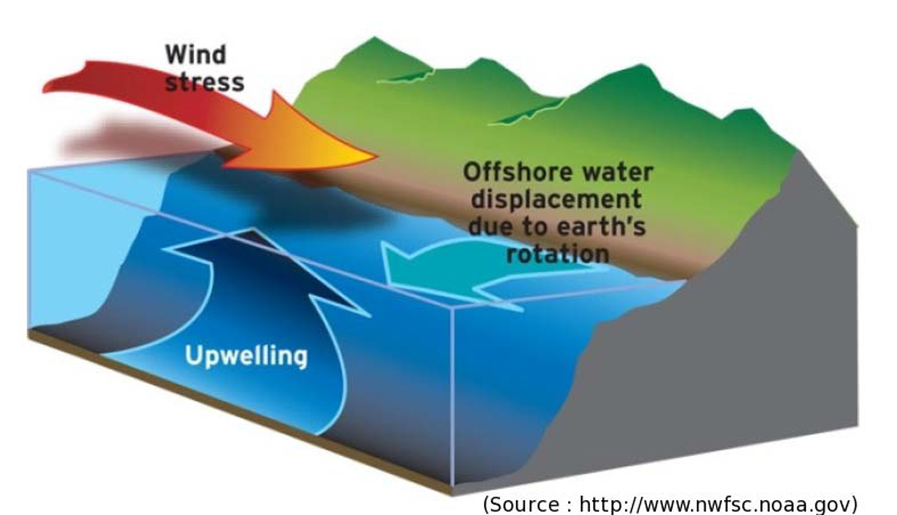
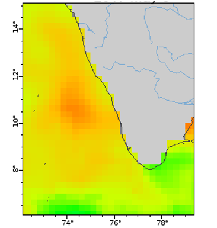
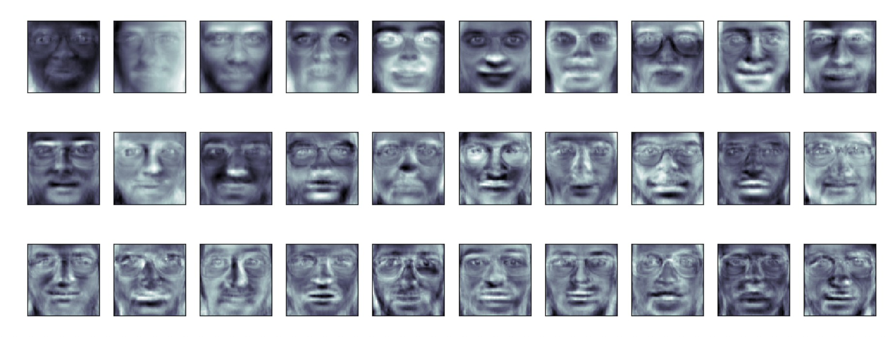
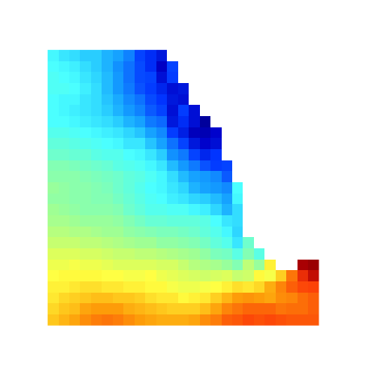
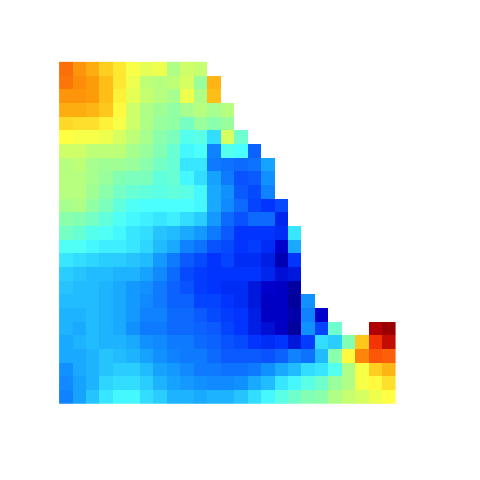

```{r setup, include=FALSE}
knitr::opts_chunk$set(echo = FALSE, cache=FALSE, fig.align="center", message=FALSE)
library(knitr)
library(ggplot2)
library(factoextra)
library(dplyr)
source(file.path(here::here(), "R", "imgVectortoRaster.R"))
```

## Topics

* Motivation for this study
* Upwelling patterns
* Common types of unsupervised image classification
  * PCA
  * K-means
  * Hierarchical clustering
* Seasonal patterns of upwelling revealed by image classification
* Changes in upwelling in the SEAS

## Why Southeast coast of India?

<b>2014-2019</b> NOAA Fisheries/India Ministry of Earth Sciences joint research on improving forecasts of the indian oil sardine

* Hugely important fishery for India. 
* India fishery produces 66–96% (average 80%) of the global oil sardine catch. 
* Southeastern Arabian Sea (Kerala) produces the vast majority of that.

<font style="color:blue">Improving forecasts using environmental covariates: a case study on the Indian oil sardine (Sardinella longiceps), May 24th, UW Fish and Wildlife Ecology Seminars.</font>

<div id="footer">
<table class="fTable">
<tr>
<td id="current">Intro</td><td>PCA</td><td>K-means</td><td>H-clusters</td><td>Summary</td>
</tr></table></div>


## {data-background="images/incois-cmlre-map-2.png"}

<div style="background-color: white">
<font size="6">Southeast Arabian Sea (SEAS) off the coast of Kerala state. ca 350 miles of coastline. Dispersed non-motorized and motorized fishery. Very productive fishing region for India.</font>
</font>
</div>

<div id="footer">
<table class="fTable">
<tr>
<td id="current">Intro</td><td>PCA</td><td>K-means</td><td>H-clusters</td><td>Summary</td>
</tr></table></div>

## Productivity in the SEAS is driven by seasonal upwelling

<div class="columns-2">
  {width=100%}
Summer monsoon brings wind and rain

  {width=100%}
Strong upwelling starts from the tip and moves north
</div>

<div id="footer">
<table class="fTable">
<tr>
<td id="current">Intro - SEAS</td><td>PCA</td><td>K-means</td><td>H-clusters</td><td>Summary</td>
</tr></table></div>

  
## Coastal upwelling leads to a characteristic SST differential

<center>
{width=60%}
</center>

* Nutrient rich water brought to the surface
* Phytoplankton blooms
* **Sea surface temperature (SST) differential**: Cold water along the coast and warm water off-shore

<div id="footer">
<table class="fTable">
<tr>
<td id="current">Intro - upwelling</td><td>PCA</td><td>K-means</td><td>H-clusters</td><td>Summary</td>
</tr></table></div>

##

<iframe width="720" height="480" src="images/Kochin_SST_2014-17_4x4.mp4" align="middle" frameborder="0" allowfullscreen></iframe>

<div id="footer">
<table class="fTable">
<tr>
<td id="current">Intro - upwelling</td><td>PCA</td><td>K-means</td><td>H-clusters</td><td>Summary</td>
</tr></table></div>

## Coastal upwelling patterns are expected to change

Land warms faster than the ocean -> changes in coastal winds

```{r, fig.align="center", out.width="60%", fig.cap="Projected warming between 2015 and 2050"}
include_graphics("images/heating-patterns.png")
```

<font size="3"> 
Di Lorenzo, E. 2015. The future of coastal ocean upwelling. Nature 518, 310–311.
</font>

<div id="footer">
<table class="fTable">
<tr>
<td id="current">Intro - upwelling</td><td>PCA</td><td>K-means</td><td>H-clusters</td><td>Summary</td>
</tr></table></div>

## 

<div class="columns-2">

### Can we use unsupervised image classification of sea surface temperature (SST) to study upwelling patterns and changes to those patterns?

{width=100%}

</div>

<div id="footer">
<table class="fTable">
<tr>
<td id="current">Intro - image classification</td><td>PCA</td><td>K-means</td><td>H-clusters</td><td>Summary</td>
</tr></table></div>


## Why unsupervised classification?

* I am looking for change not a specific pattern
* I am looking for novel patterns because things are changing
* I worked with other upwelling metrics a lot and am looking for new approaches.

<center>
<div style="float:right">
{width=40%}
{width=40%}
</div>
</center>

<div id="footer">
<table class="fTable">
<tr>
<td id="current">Intro - image classification</td><td>PCA</td><td>K-means</td><td>H-clusters</td><td>Summary</td>
</tr></table></div>


## Today's seminar

### Three types of unsupervised image classification

* Principal Components Analysis (PCA) or Empirical Othogonal Factorization (EOF)
* K-means clustering
* Hierarchical clustering

### Changes in the upwelling patterns in the SEAS

* As revealed by the image classification
* Changes to the <font style="color:red">pattern</font> not absolute temperature
* Arabian Sea has warmed a lot in the past 2 decades. I have removed that by removing the mean from each image.

<div id="footer">
<table class="fTable">
<tr>
<td id="current">Intro</td><td>PCA</td><td>K-means</td><td>H-clusters</td><td>Summary</td>
</tr></table></div>


## Working with images

* An image has $p$ pixels
* Each row is an image. Each column is a pixel. 
* Get rid of the NA (land) columns. No NAs allowed otherwise.
* Values are temperature with the mean temperature in that image subtracted. In some applications, you would standardize the variance to 1.

Here are 5 images and just the first 10 pixels of the image.

```{r echo=FALSE}
# Data
datafile <- file.path(here::here(), "data", "SEAS-monthly-sst.RData")
load(datafile)
datalist <- out
# Data for clustering functions
Data_clean <- out$dat.clean
X <- Data_clean[c(-1,-2),] - 273.15
X_norm <- t(scale(t(X), scale=FALSE))
colnames(X_norm) <- paste0("p", 1:ncol(X_norm))
round(X_norm[1:5, 1:10], digits=2)
```

<div id="footer">
<table class="fTable">
<tr>
<td id="current">Intro - images</td><td>PCA</td><td>K-means</td><td>H-clusters</td><td>Summary</td>
</tr></table></div>

## PCA (and EOF)

* Each image (a data set with $p$ variables) can be expressed as the weighted sum of orthogonal images (i.e. independent).
* The vector is length $p$ (number of pixels)
* The first vector captures most of the variance in the images.

$$\text{image} = \alpha_1 \lambda_1 + \alpha_2 \lambda_2 + \alpha_3 \lambda_3 + \dots$$
*For those familiar with singular value decomposition*
$$
\underbrace{\mathbf{X}}_{\text{data}}= \underbrace{\mathbf{U}\,\,\mathbf{D}}_{\alpha}
\underbrace{\mathbf{V}^\top}_{\lambda}
$$
<div id="footer">
<table class="fTable">
<tr>
<td>Intro</td><td id="current">PCA - overview</td><td>K-means</td><td>H-clusters</td><td>Summary</td>
</tr></table></div>

## Classic example is facial recognition: eigenfaces

<center>
{width=75%}
{width=75%}
</center>

<div id="footer">
<table class="fTable">
<tr>
<td>Intro</td><td id="current">PCA - overview</td><td>K-means</td><td>H-clusters</td><td>Summary</td>
</tr></table></div>


## PCA and EOF also used in oceanography

Pacific Decadal Oscillation index is an example. It is the weighting ($\alpha$) on the first $\lambda$ from gridded SST anomalies in the North Pacific.

<div id="footer">
<table class="fTable">
<tr>
<td>Intro</td><td id="current">PCA - overview</td><td>K-means</td><td>H-clusters</td><td>Summary</td>
</tr></table></div>


## Let's see how to do it

<!--
With Singular Value Decomposition:
```{r echo=TRUE}
pca <- svd(X_norm) #singular value decomposition
eigenimages <- t(pca$v)
rownames(eigenimages) <- paste0("lambda", 1:nrow(eigenimages))
alpha <- pca$u %*% diag(pca$d)
colnames(alpha) <- paste0("PC", 1:ncol(alpha))
```
-->

Let's use `prcomp` in R. Using `prcomp` means you can use the visualization tools in R for PCA.
```{r echo=TRUE}
prcomp.pca <- prcomp(X_norm, scale = FALSE, center=FALSE)
```

```{r}
# Do this so the first image looks like upwelling
prcomp.pca$rotation[,1] <- -1*prcomp.pca$rotation[,1]
prcomp.pca$x[,1] <- -1*prcomp.pca$x[,1]
# Store for use later
eigenimages <- t(prcomp.pca$rotation)
alpha <- prcomp.pca$x
```

```{r echo=FALSE, warning=FALSE}
# Set up the data frame
library(tidyr)
df <- data.frame(alpha,
                date=as.Date(rownames(X_norm)),
                year=as.integer(format(as.Date(rownames(X_norm)), "%Y")),
                mon=factor(format(as.Date(rownames(X_norm)), "%b"), levels=month.abb),
                decade=cut(as.integer(format(as.Date(rownames(X_norm)), "%Y")), breaks=seq(1970,2020,10), labels=c("71-80", "81-90", "91-00", "01-10", "11-20")))
df2 = pivot_longer(df, starts_with("PC"), names_to="PC", values_to="value")
```

* The $\lambda$ are in `prcomp.pca$rotation` with each column an "eigen image".
* The $\alpha$ are in `prcomp.pca$x`. One for each image and each $\lambda$.

<div id="footer">
<table class="fTable">
<tr>
<td>Intro</td><td id="current">PCA - sst images</td><td>K-means</td><td>H-clusters</td><td>Summary</td>
</tr></table></div>

##

Eigen images. Just first 10 pixels of the image are shown.
```{r echo=TRUE}
eigenimages <- t(prcomp.pca$rotation)
round(eigenimages[1:5, 1:10], digits=2)
```

```
# if image is say 25x25
library(raster)
img <- as.raster(matrix(eigenimages[1,], byrow=TRUE, ncol=25))
plot(img)
```

<div id="footer">
<table class="fTable">
<tr>
<td>Intro</td><td id="current">PCA - sst images</td><td>K-means</td><td>H-clusters</td><td>Summary</td>
</tr></table></div>

##

```{r echo=FALSE, message=FALSE, warning=FALSE}
img.list <- imgVectortoRaster(eigenimages, datalist)$list
```

<center>
```{r echo=FALSE, message=FALSE, warning=FALSE}
p_stack <- raster::stack(img.list[[1]], img.list[[2]], img.list[[3]], 
                 img.list[[4]], img.list[[5]], img.list[[6]])
library(tmap)
pal <- colorRamps::matlab.like(100)
tm_shape(p_stack) + 
  tm_raster(style= "cont", title="SST Anomaly", 
            palette=pal, midpoint=NA, 
            colorNA = "grey", textNA = "Land") +
  tm_layout(panel.labels = paste("PC", 1:length(p_stack))) +
  tm_layout(main.title = "Eigen Images", title.size = 1)
```
</center>

<div id="footer">
<table class="fTable">
<tr>
<td>Intro</td><td id="current">PCA - eigen images</td><td>K-means</td><td>H-clusters</td><td>Summary</td>
</tr></table></div>


## Reconstructing the SST images

```{r message=FALSE, warning=FALSE, eval=FALSE}
library(png)
library(raster)
for(i in 1:6){
png(filename=paste0("images/eigen",i,".png"))
plot(img.list[[i]], legend=FALSE, axes=FALSE, box=FALSE, col=pal)
dev.off()
}
```

<!--
$$\text{image} = \alpha_1 \lambda_1 + \alpha_2 \lambda_2 + \alpha_3 \lambda_3 + \dots$$
-->

image =  $\alpha_1 \times$  + $\alpha_2 \times$  + $\alpha_3 \times$  + $\dots$


```{r}
#reconstruction
ncomp <- 1
RE1 <- alpha[,1:ncomp, drop=FALSE] %*% eigenimages[1:ncomp,, drop=FALSE]
ncomp <- 2
RE2 <- alpha[,1:ncomp] %*% eigenimages[1:ncomp,]
ncomp <- 3
RE3 <- alpha[,1:ncomp] %*% eigenimages[1:ncomp,]
```

<div id="footer">
<table class="fTable">
<tr>
<td>Intro</td><td id="current">PCA - reconstuction</td><td>K-means</td><td>H-clusters</td><td>Summary</td>
</tr></table></div>


## August

```{r echo=FALSE}
i <- 452
img1 <- imgVectortoRaster(rbind(X_norm[i,], RE1[i,], RE2[i,], RE3[i,]), datalist)$stack
tm_shape(img1) + 
  tm_raster(style= "cont", title="SST Anomaly", 
            palette=pal, midpoint=NA, 
            colorNA = "grey", textNA = "Land") +
  tm_layout(panel.labels = c("True", "1 PC", "2 PC", "3 PC"),
            title=rownames(X_norm)[i])
```

<div id="footer">
<table class="fTable">
<tr>
<td>Intro</td><td id="current">PCA - reconstuction</td><td>K-means</td><td>H-clusters</td><td>Summary</td>
</tr></table></div>

## March

```{r echo=FALSE}
i <- 447
img1 <- imgVectortoRaster(rbind(X_norm[i,], RE1[i,], RE2[i,], RE3[i,]), datalist)$stack
tm_shape(img1) + 
  tm_raster(style= "cont", title="SST Anomaly", 
            palette=pal, midpoint=NA, 
            colorNA = "grey", textNA = "Land") +
  tm_layout(panel.labels = c("True", "1 PC", "2 PC", "3 PC"),
            title=rownames(X_norm)[i])
```

<div id="footer">
<table class="fTable">
<tr>
<td>Intro</td><td id="current">PCA - reconstuction</td><td>K-means</td><td>H-clusters</td><td>Summary</td>
</tr></table></div>


## May

```{r echo=FALSE}
i <- 449
img1 <- imgVectortoRaster(rbind(X_norm[i,], RE1[i,], RE2[i,], RE3[i,]), datalist)$stack
tm_shape(img1) + 
  tm_raster(style= "cont", title="SST Anomaly", 
            palette=pal, midpoint=NA, 
            colorNA = "grey", textNA = "Land") +
  tm_layout(panel.labels = c("True", "1 PC", "2 PC", "3 PC"),
            title=rownames(X_norm)[i])
```

<div id="footer">
<table class="fTable">
<tr>
<td>Intro</td><td id="current">PCA - reconstuction</td><td>K-means</td><td>H-clusters</td><td>Summary</td>
</tr></table></div>

## Variance (in data set) explained

```{r}
fviz_eig(prcomp.pca) + xlab("Principal Components") + ggtitle("")
```

<div id="footer">
<table class="fTable">
<tr>
<td>Intro</td><td id="current">PCA - explained variance</td><td>K-means</td><td>H-clusters</td><td>Summary</td>
</tr></table></div>

## SST Anomaly pattern in the PC1-PC2 space

```{r echo=FALSE, warning=FALSE}
wid <- 1.25
p <- ggplot(df, aes(x=PC1, y=PC2)) + geom_point(col=NA)
xs <- seq(min(df$PC1)+.2*wid,max(df$PC1), 2.2*wid)
ys <- seq(min(df$PC2)+.2*wid,max(df$PC2), 2.2*wid)
for(i in xs){
  for(j in ys){
  x <- c(i, j)
    img.list <- imgVectortoRaster(t(prcomp.pca$rotation[,1:2] %*% matrix(x, ncol=1)), datalist)$list
    img <- raster::as.raster(img.list[[1]])
    img[is.na(img)] <- "#808080"
    g <- grid::rasterGrob(img, interpolate=TRUE)
    p <- p +
      annotation_custom(g, xmin=x[1]-wid, xmax=x[1]+wid, ymin=x[2]-wid, ymax=x[2]+wid)
  }
}
p + 
  geom_hline(yintercept=0) +
  geom_vline(xintercept=0)
```   

<div id="footer">
<table class="fTable">
<tr>
<td>Intro</td><td id="current">PCA - PC 1&2</td><td>K-means</td><td>H-clusters</td><td>Summary</td>
</tr></table></div>

##

```{r echo=FALSE, warning=FALSE}
fviz_pca_ind(prcomp.pca,
             col.ind = factor(format(as.Date(rownames(X_norm)), "%B"), levels=month.name),
             geom="point",
             addEllipses=TRUE
             ) + ggtitle("PC1/PC1 loadings (+ = upwelling) by month")
```

<div id="footer">
<table class="fTable">
<tr>
<td>Intro</td><td id="current">PCA - seasonal pattern</td><td>K-means</td><td>H-clusters</td><td>Summary</td>
</tr></table></div>

## 1980s versus 2010s

```{r echo=FALSE, warning=FALSE}
p <- ggplot(subset(df, decade%in%c("81-90","11-20")), aes(x=PC1, y=PC2, col=decade)) +
  geom_point() +
  geom_hline(yintercept=0) +
  geom_vline(xintercept=0) +
  facet_wrap(~mon) +
  ggtitle("1980s versus 2010s")
p
```

<div id="footer">
<table class="fTable">
<tr>
<td>Intro</td><td id="current">PCA - upwelling changes</td><td>K-means</td><td>H-clusters</td><td>Summary</td>
</tr></table></div>


##

```{r echo=FALSE}
p <- ggplot(subset(df2, PC %in% c("PC1")), aes(x=date, y=value, fill=value>0)) +
  geom_col(width=300) +
  facet_wrap(~mon) +
  xlab("") +
  theme(axis.text.x = element_text(angle = 90, vjust = 0.5, hjust=1),
        legend.position = "none") +
  ggtitle("PC1 loadings")

p
```

<div id="footer">
<table class="fTable">
<tr>
<td>Intro</td><td id="current">PCA - upwelling changes</td><td>K-means</td><td>H-clusters</td><td>Summary</td>
</tr></table></div>

##

```{r echo=FALSE}
df3 <- subset(df2, PC %in% c("PC1"))
df3 <- df3 %>% group_by(mon) %>%
  mutate(center=value-mean(value),
         mean=mean(value))
df3$lab <- factor(paste(df3$mon, round(df3$mean, digits=2)),
                  levels=paste(month.abb, round(tapply(df3$mean, df3$mon, unique), digits=2)))
                  
p <- ggplot(df3, aes(x=date, y=center, fill=center>0)) +
  geom_col(width=300) +
  facet_wrap(~lab) +
  xlab("") +
  theme(axis.text.x = element_text(angle = 90, vjust = 0.5, hjust=1),
        legend.position = "none") +
  ggtitle("PC1 loadings relative to mean")

p
```

<div id="footer">
<table class="fTable">
<tr>
<td>Intro</td><td id="current">PCA - upwelling changes</td><td>K-means</td><td>H-clusters</td><td>Summary</td>
</tr></table></div>

## September and August seem to be changing

```{r warning=FALSE, message=FALSE}
ncomp <- 1:2
df4 <- subset(df2, PC %in% paste0("PC", ncomp))
df4$PC <- factor(df4$PC, level=paste0("PC", ncomp))
df4 <- df4 %>% group_by(PC, mon) %>%
  mutate(mean=mean(value),
         err=value-mean)
df5 <- df4 %>% group_by(mon, date) %>% 
  summarize(distance=sqrt(sum(err^2)))
```

```{r}
ggplot(df5, aes(x=date, y=distance)) + geom_point() +
  geom_smooth(span = 0.9) + xlab("") + 
  theme(axis.text.x = element_text(angle = 45, vjust = 1, hjust=1)) +
  ggtitle("Distance moved in PC1-PC2 space") +
  facet_wrap(~mon)
```

<div id="footer">
<table class="fTable">
<tr>
<td>Intro</td><td id="current">PCA - upwelling changes</td><td>K-means</td><td>H-clusters</td><td>Summary</td>
</tr></table></div>

## August images

<center>
```{r}
loc <- which(rownames(X_norm)%in%paste0(1980:2019,"-08-01"))
img1 <- imgVectortoRaster(X_norm[loc,], datalist)$stack
tm_shape(img1) + 
  tm_raster(style= "cont", title="SST Anomaly", 
            palette=pal, midpoint=NA, 
            colorNA = "grey", textNA = "Land") +
  tm_layout(panel.labels = rownames(X_norm)[loc])
```
</center>

<div id="footer">
<table class="fTable">
<tr>
<td>Intro</td><td id="current">PCA - upwelling changes</td><td>K-means</td><td>H-clusters</td><td>Summary</td>
</tr></table></div>


## Outlier identification

Use the first 10 dimensions.

```{r warning=FALSE, message=FALSE}
ncomp <- 1:10
df4 <- subset(df2, PC %in% paste0("PC", ncomp))
df4$PC <- factor(df4$PC, level=paste0("PC", ncomp))
df4 <- df4 %>% group_by(PC, mon) %>%
  mutate(mean=mean(value),
         err=value-mean)
df5 <- df4 %>% group_by(mon, date) %>% 
  summarize(distance=sqrt(sum(err^2)))
```

```{r}
ggplot(df5, aes(x=date, y=distance)) + geom_point() +
  geom_smooth(span = 0.9) + xlab("") + 
  theme(axis.text.x = element_text(angle = 45, vjust = 1, hjust=1)) +
  ggtitle("Distance moved in PC1-PC2 space") +
  facet_wrap(~mon)
```

<div id="footer">
<table class="fTable">
<tr>
<td>Intro</td><td id="current">PCA - upwelling changes</td><td>K-means</td><td>H-clusters</td><td>Summary</td>
</tr></table></div>

## March images

<center>
```{r}
loc <- which(rownames(X_norm)%in%paste0(1980:2019,"-03-01"))
img1 <- imgVectortoRaster(X_norm[loc,], datalist)$stack
tm_shape(img1) + 
  tm_raster(style= "cont", title="SST Anomaly", 
            palette=pal, midpoint=NA, 
            colorNA = "grey", textNA = "Land") +
  tm_layout(panel.labels = rownames(X_norm)[loc])
```
</center>

<div id="footer">
<table class="fTable">
<tr>
<td>Intro</td><td id="current">PCA - upwelling changes</td><td>K-means</td><td>H-clusters</td><td>Summary</td>
</tr></table></div>


## Summer monsoon winds drive intense upwelling off the SW coast of India

<div class="columns-2">
  {width=100%}
* Wind and rain

  {width=100%}
  * Strong upwelling starts from the tip and moves north

</div>
